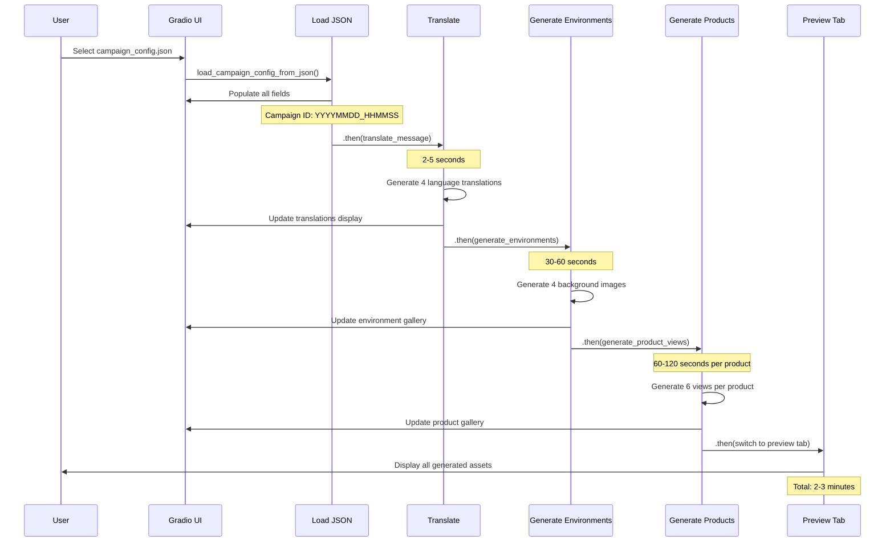
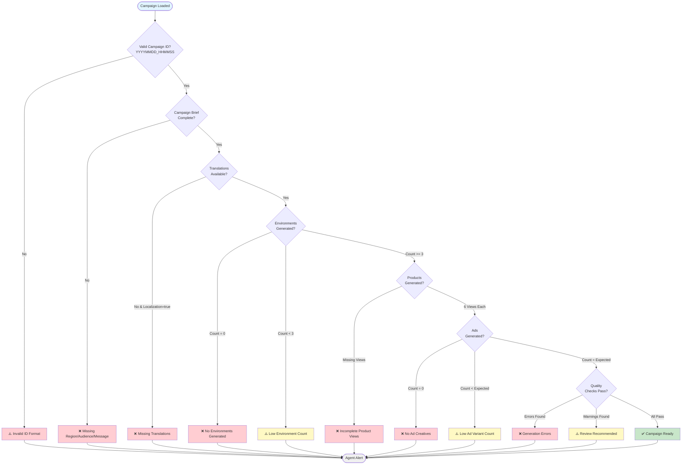
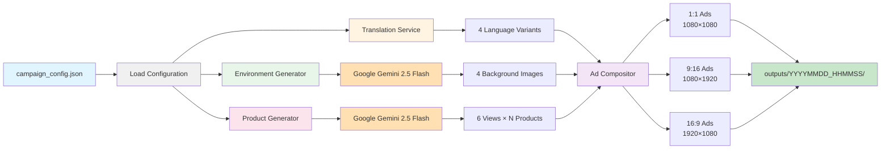
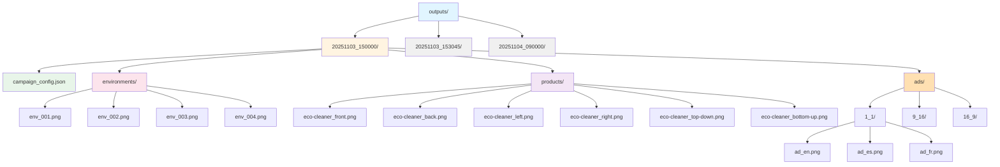
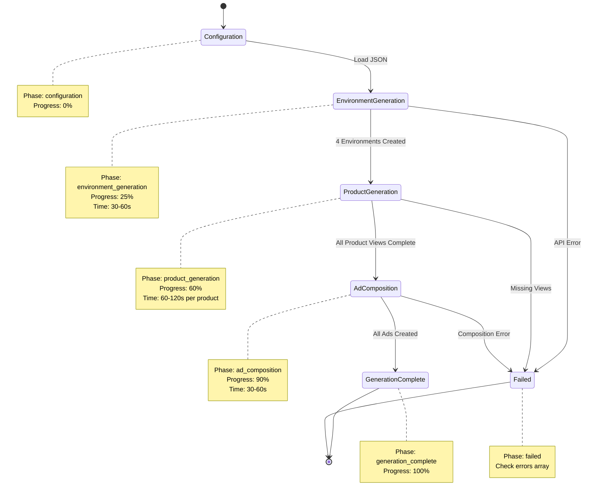
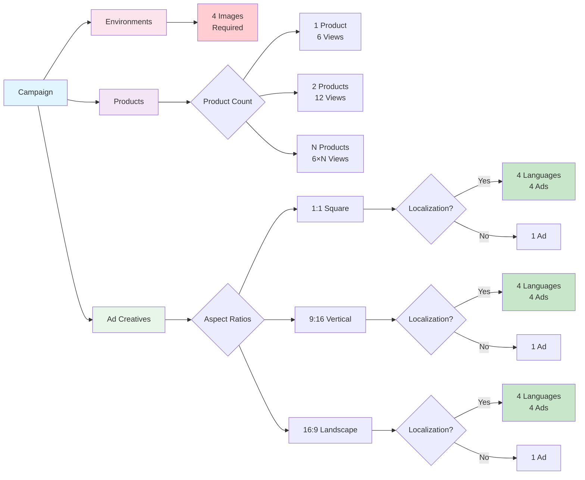
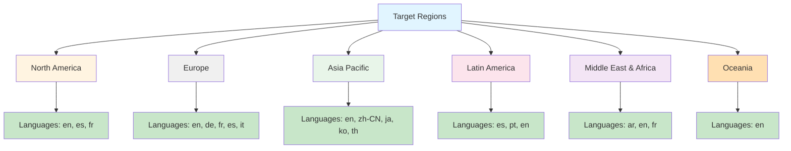

# Campaign Monitoring - Mermaid Visualizations

This document provides visual diagrams for the Campaign Monitoring Agent using Mermaid syntax.

---

## 1. Automated Workflow Sequence

---

## 2. Campaign Data Structure

```mermaid
graph TB
    Campaign[Campaign Configuration]

    Campaign --> Brief[Campaign Brief]
    Campaign --> GenConfig[Generation Config]
    Campaign --> AdSettings[Ad Settings]
    Campaign --> Assets[Asset Inventory]
    Campaign --> Status[Campaign Status]

    Brief --> ID[Campaign ID<br/>YYYYMMDD_HHMMSS]
    Brief --> Target[Targeting<br/>Region + Audience]
    Brief --> Message[Messaging<br/>Primary + Translations]

    GenConfig --> EnvPrompt[Environment Prompt]
    GenConfig --> Products[Product Slugs]
    GenConfig --> Mode[Product Mode<br/>separate/combined]
    GenConfig --> Logos[Logo Paths]

    AdSettings --> Ratios[Aspect Ratios<br/>1:1, 9:16, 16:9]
    AdSettings --> Local[Localization<br/>Per Format]
    AdSettings --> IncLogo[Include Logo<br/>Per Format]

    Assets --> Environments[Environments<br/>4 images]
    Assets --> ProductViews[Product Views<br/>6 per product]
    Assets --> Ads[Ad Creatives<br/>3 aspect ratios]

    Status --> Phase[Phase<br/>configuration/generation/complete]
    Status --> Progress[Progress %]
    Status --> Errors[Errors/Warnings]

    style Campaign fill:#e1f5ff
    style Brief fill:#fff4e1
    style GenConfig fill:#f0f0f0
    style AdSettings fill:#e8f5e9
    style Assets fill:#fce4ec
    style Status fill:#f3e5f5
```

---

## 3. Monitoring Decision Flow

---

## 4. Asset Generation Pipeline

---

## 5. Alert Severity Levels

```mermaid
graph TB
    Alerts[Campaign Alerts]

    Alerts --> Critical[❌ CRITICAL ALERTS]
    Alerts --> Warning[⚠️ WARNING ALERTS]
    Alerts --> Info[ℹ️ INFO ALERTS]

    Critical --> C1[No Assets Generated<br/>Immediate Action Required]
    Critical --> C2[Incomplete Product Views<br/>Missing Camera Angles]
    Critical --> C3[Generation Failure<br/>API/System Error]
    Critical --> C4[Missing Translations<br/>Localization Enabled]

    Warning --> W1[Low Variant Count<br/>< 3 per aspect ratio]
    Warning --> W2[Insufficient Environment Diversity<br/>< 3 backgrounds]
    Warning --> W3[Single Product + Combined Mode<br/>Consider separate mode]
    Warning --> W4[Long Generation Time<br/>> 10 minutes]
    Warning --> W5[Invalid Campaign ID Format<br/>Not YYYYMMDD_HHMMSS]

    Info --> I1[Campaign Complete<br/>Ready for Review]
    Info --> I2[Generation In Progress<br/>Current Phase: X%]
    Info --> I3[Assets Refreshed<br/>New variants available]

    style Alerts fill:#e1f5ff
    style Critical fill:#ffcdd2
    style Warning fill:#fff9c4
    style Info fill:#c8e6c9
    style C1 fill:#ef5350
    style C2 fill:#ef5350
    style C3 fill:#ef5350
    style C4 fill:#ef5350
    style W1 fill:#ffeb3b
    style W2 fill:#ffeb3b
    style W3 fill:#ffeb3b
    style W4 fill:#ffeb3b
    style W5 fill:#ffeb3b
    style I1 fill:#66bb6a
    style I2 fill:#66bb6a
    style I3 fill:#66bb6a
```

---

## 6. File System Organization

---

## 7. Campaign Status State Machine

---

## 8. Expected Asset Counts

---

## 9. Region and Language Mapping

---

## 10. Monitoring Agent Architecture

```mermaid
graph TB
    Agent[Monitoring Agent]

    Agent --> Input[Input Layer]
    Agent --> Process[Processing Layer]
    Agent --> Output[Output Layer]

    Input --> ReadJSON[Read campaign_config.json]
    Input --> ReadFiles[Scan File System]
    Input --> ReadLogs[Check Generation Logs]

    Process --> Validate[Validate Configuration]
    Process --> Count[Count Assets]
    Process --> Compare[Compare Expected vs Actual]
    Process --> Analyze[Analyze Metrics]

    Validate --> V1[Campaign ID Format]
    Validate --> V2[Required Fields]
    Validate --> V3[Path Existence]

    Count --> C1[Environment Images]
    Count --> C2[Product Views]
    Count --> C3[Ad Creatives]

    Compare --> CP1[Expected Translations]
    Compare --> CP2[Expected Environments]
    Compare --> CP3[Expected Product Views]
    Compare --> CP4[Expected Ad Variants]

    Analyze --> A1[Generation Time]
    Analyze --> A2[File Sizes]
    Analyze --> A3[Variant Diversity]

    Output --> Alert[Generate Alerts]
    Output --> Report[Generate Report]
    Output --> Notify[Notify User]

    Alert --> Critical2[Critical Issues]
    Alert --> Warning2[Warnings]
    Alert --> Info2[Informational]

    style Agent fill:#e1f5ff
    style Input fill:#fff4e1
    style Process fill:#e8f5e9
    style Output fill:#fce4ec
    style Critical2 fill:#ffcdd2
    style Warning2 fill:#fff9c4
    style Info2 fill:#c8e6c9
```

---

Each diagram visualizes a different aspect of the campaign monitoring system:
1. **Sequence Diagram** - Temporal flow of automated workflow
2. **Data Structure** - Hierarchical organization of campaign data
3. **Decision Flow** - Monitoring logic and alert triggers
4. **Pipeline** - Asset generation technical architecture
5. **Alert Levels** - Categorization of monitoring alerts
6. **File System** - Directory structure and organization
7. **State Machine** - Campaign status transitions
8. **Asset Counts** - Expected output calculations
9. **Region Mapping** - Language translation requirements
10. **Agent Architecture** - Monitoring agent internal structure
